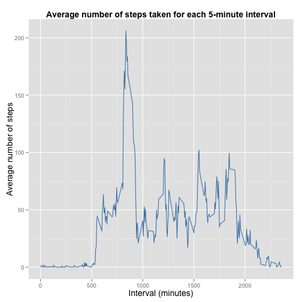

<br>

### Loading the required libraries

```r
library(dplyr)
library(ggplot2)
library(lattice)
```
<br>

### Loading and preprocessing the data

<br>**Load data and ensure that the appropriate class is assigned to each column**

```r
unzip("activity.zip")
data <- read.csv("activity.csv",colClasses = c("integer","Date","integer"))
```

<br>**Remove row with NA values**

```r
noNA_row = !is.na(data$steps)
noNA <- data[noNA_row,]
```
<br><br>

## Ignoring the missing values in the dataset, what is the mean and median of total number of steps taken per day?  

<br>**1. Calculate the total number of steps taken per day**

```r
noNAdate <- group_by(noNA,date)
stepsByDay <-summarise(noNAdate,total_steps=sum(steps))
print(stepsByDay)
```

```
## Source: local data frame [53 x 2]
## 
##          date total_steps
## 1  2012-10-02         126
## 2  2012-10-03       11352
## 3  2012-10-04       12116
## 4  2012-10-05       13294
## 5  2012-10-06       15420
## 6  2012-10-07       11015
## 7  2012-10-09       12811
## 8  2012-10-10        9900
## 9  2012-10-11       10304
## 10 2012-10-12       17382
## ..        ...         ...
```

<br>**2. Make a histogram of the total number of steps taken each day**

```r
ggplot(stepsByDay, aes(date, total_steps)) + geom_bar(stat = "identity", fill = "steelblue", width = 0.8) + labs(title = "Total number of steps per day") + labs(x = "Date", y = "Total number of steps") + theme(plot.title=element_text(size=10,face="bold"), axis.title=element_text(size=10))
```

 

<br>**3. Calculate the mean and median of the total number of steps taken per day**

```r
mean = mean(stepsByDay$total_steps)
median = median(stepsByDay$total_steps)
```
The mean of the total number of steps taken per day is 1.0766189 &times; 10<sup>4</sup> and the median is 10765.
<br><br>

## What is the average daily activity pattern?

<br>**1a. Calculate average number of steps taken for each 5-minute interval**

```r
noNAinterval <- group_by(noNA,interval)
AveStepsByInterval <-summarise(noNAinterval,average_steps=mean(steps))
print(AveStepsByInterval)
```

```
## Source: local data frame [288 x 2]
## 
##    interval average_steps
## 1         0     1.7169811
## 2         5     0.3396226
## 3        10     0.1320755
## 4        15     0.1509434
## 5        20     0.0754717
## 6        25     2.0943396
## 7        30     0.5283019
## 8        35     0.8679245
## 9        40     0.0000000
## 10       45     1.4716981
## ..      ...           ...
```

<br>**1b. Make a time series plot of the 5-minute interval (x-axis) and the average number of steps taken, averaged across all days (y-axis)**

```r
ggplot(AveStepsByInterval, aes(interval, average_steps)) + geom_line(stat = "identity", color = "steelblue") + labs(title = "Average number of steps taken for each 5-minute interval") + labs(x = "Interval (minutes)", y = "Average number of steps") + theme(plot.title=element_text(size=10,face="bold"), axis.title=element_text(size=10))
```

 

<br>**2. Which 5-minute interval, on average across all the days in the dataset, contains the maximum number of steps?**

```r
AveStepsByInterval[which.max(AveStepsByInterval$average_steps),]
```

```
## Source: local data frame [1 x 2]
## 
##   interval average_steps
## 1      835      206.1698
```
<br><br>
  
## Imputing missing values

<br>**1. Calculate the total number of missing values in the dataset (i.e. the total number of rows with NAs)**

```r
totalNA = sum(is.na(data))
print(totalNA)
```

```
## [1] 2304
```
There are 2304 rows with missing values in the dataset.

<br>**2. Devise a strategy for filling in all of the missing values in the dataset**  
The strategy is to fill in each missing value in the dataset with the average number of steps taken for the corresponding 5-minute interval.  

<br>**3. Create a new dataset that is equal to the original dataset but with the missing data filled in**

```r
newData <- data
for(i in 1:nrow(newData)) {
    if(is.na(newData$steps[i])) {
        newData$steps[i] = AveStepsByInterval[AveStepsByInterval$interval == newData$interval[i],2]
    }
}
newData$steps <- as.numeric(newData$steps)
```
Below are the first 6 rows of the new dataset:

```r
head(newData)
```

```
##       steps       date interval
## 1 1.7169811 2012-10-01        0
## 2 0.3396226 2012-10-01        5
## 3 0.1320755 2012-10-01       10
## 4 0.1509434 2012-10-01       15
## 5 0.0754717 2012-10-01       20
## 6 2.0943396 2012-10-01       25
```

<br>**4a. Using the new dataset, make a histogram of the total number of steps taken each day. Calculate and report the mean and median total number of steps taken per day**

Total number of steps taken per day:

```r
newDataDate <- group_by(newData,date)
newStepsByDay <-summarise(newDataDate,total_steps=sum(steps))
print(newStepsByDay)
```

```
## Source: local data frame [61 x 2]
## 
##          date total_steps
## 1  2012-10-01    10766.19
## 2  2012-10-02      126.00
## 3  2012-10-03    11352.00
## 4  2012-10-04    12116.00
## 5  2012-10-05    13294.00
## 6  2012-10-06    15420.00
## 7  2012-10-07    11015.00
## 8  2012-10-08    10766.19
## 9  2012-10-09    12811.00
## 10 2012-10-10     9900.00
## ..        ...         ...
```


```r
ggplot(newStepsByDay, aes(date, total_steps)) + geom_bar(stat = "identity", fill = "steelblue", width = 0.8) + labs(title = "Total number of steps per day") + labs(x = "Date", y = "Total number of steps") +  theme(plot.title=element_text(size=10,face="bold"), axis.title=element_text(size=10))
```

 


```r
new_mean = mean(newStepsByDay$total_steps)
new_median = median(newStepsByDay$total_steps)
```
The mean of the total number of steps taken per day is 1.0766189 &times; 10<sup>4</sup> and the median is 1.0766189 &times; 10<sup>4</sup>.

<br>**4b Do these values differ from the estimates from the first part of the assignment? What is the impact of imputing missing data on the estimates of the total daily number of steps?**

```r
mean_diff = new_mean - mean
```
The differences between the new mean and the old mean = 0.


```r
median_diff = new_median - median
```
The differences between the new median and the old median = 1.1886792

Imputing missing values affects the median, but does not affect the mean calculation.
<br><br>

## Are there differences in activity patterns between weekdays and weekends?

<br>**1. Using the dataset with filled-in missing values, create a new factor variable in the dataset with two levels – “weekday” and “weekend” indicating whether a given date is a weekday or weekend day**

Add 1 factor variable in the new dataset to indicate name of day corresponding to each given date

```r
newData$day <- as.factor(weekdays(newData$date))
head (newData)
```

```
##       steps       date interval    day
## 1 1.7169811 2012-10-01        0 Monday
## 2 0.3396226 2012-10-01        5 Monday
## 3 0.1320755 2012-10-01       10 Monday
## 4 0.1509434 2012-10-01       15 Monday
## 5 0.0754717 2012-10-01       20 Monday
## 6 2.0943396 2012-10-01       25 Monday
```

Show current levels of the factor variable

```r
levels(newData$day)
```

```
## [1] "Friday"    "Monday"    "Saturday"  "Sunday"    "Thursday"  "Tuesday"  
## [7] "Wednesday"
```

Create a new factor variable with two levels - "weekday" and "weekend"

```r
levels(newData$day) = list(weekday = c("Monday", "Tuesday", "Wednesday", "Thursday", "Friday"), weekend = c("Saturday", "Sunday"))
levels(newData$day)
```

```
## [1] "weekday" "weekend"
```

Show dataset with the new factor variable

```r
head(newData)
```

```
##       steps       date interval     day
## 1 1.7169811 2012-10-01        0 weekday
## 2 0.3396226 2012-10-01        5 weekday
## 3 0.1320755 2012-10-01       10 weekday
## 4 0.1509434 2012-10-01       15 weekday
## 5 0.0754717 2012-10-01       20 weekday
## 6 2.0943396 2012-10-01       25 weekday
```

<br>**2. Make a panel plot containing a time series plot of the 5-minute interval (x-axis) and the average number of steps taken, averaged across all weekday days or weekend days (y-axis)**

Average number of steps taken for each 5-minute interval across all weekday days or weekend days:


```r
newDataInterval <- group_by(newData,interval,day)
newAveStepsByInterval <-summarise(newDataInterval,average_steps=mean(steps))
print(newAveStepsByInterval)
```

```
## Source: local data frame [576 x 3]
## Groups: interval
## 
##    interval     day average_steps
## 1         0 weekday   2.251153040
## 2         0 weekend   0.214622642
## 3         5 weekday   0.445283019
## 4         5 weekend   0.042452830
## 5        10 weekday   0.173165618
## 6        10 weekend   0.016509434
## 7        15 weekday   0.197903564
## 8        15 weekend   0.018867925
## 9        20 weekday   0.098951782
## 10       20 weekend   0.009433962
## ..      ...     ...           ...
```


```r
xyplot(average_steps ~ interval | day, data=newAveStepsByInterval, layout=c(1,2), type="l", xlab="Interval", ylab="Number of steps")
```

 
